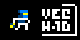
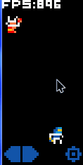

<h1 align="center">
  
  

  
  
  
   
  
  
  
   
  
  
   
  
</h1>

A simple Game where you have to destroy the enemy before they destroy you!

## Resource used
4x4 Pixel Font (c) who?
Music (c) Fesliyan Studios Background Music